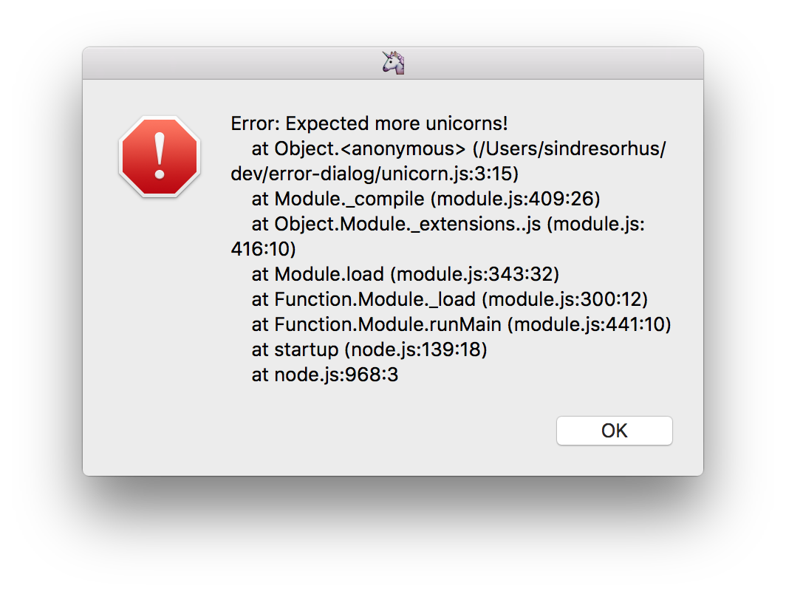

# error-dialog

> Display an error in a GUI dialog



macOS only, but pull request welcome for Linux and Windows support.

## Install

```
$ npm install error-dialog
```

## Usage

```js
import errorDialog from 'error-dialog';

const error = new Error('Expected more unicorns!');

await errorDialog(error, '🦄');
```

## API

### errorDialog(error, windowTitle?)

Returns a `Promise`.

#### error

Type: `Error | string`

An error or error message.

#### windowTitle

Type: `string`

## Related

- [cocoa-dialog](https://github.com/sindresorhus/cocoa-dialog) - Display common GUI dialogs on macOS
